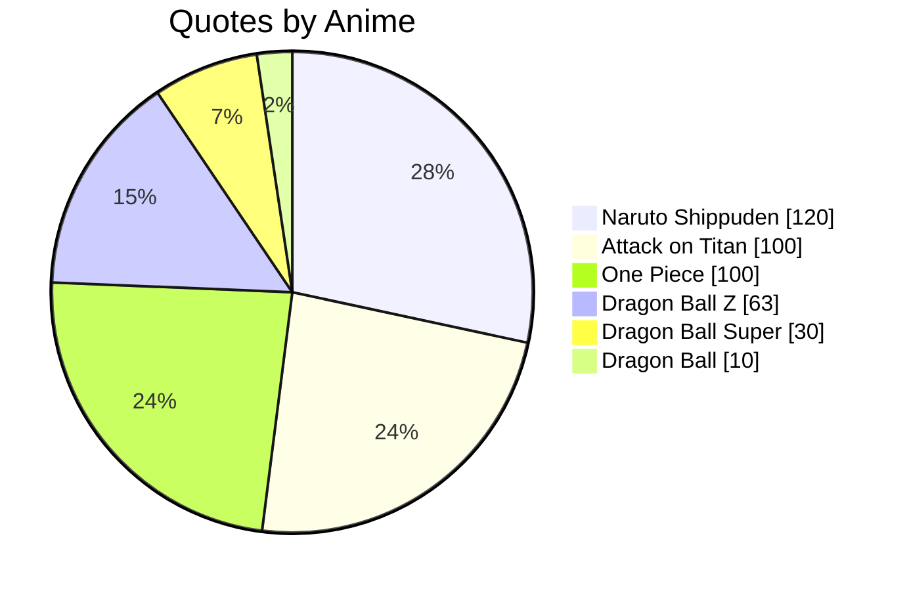
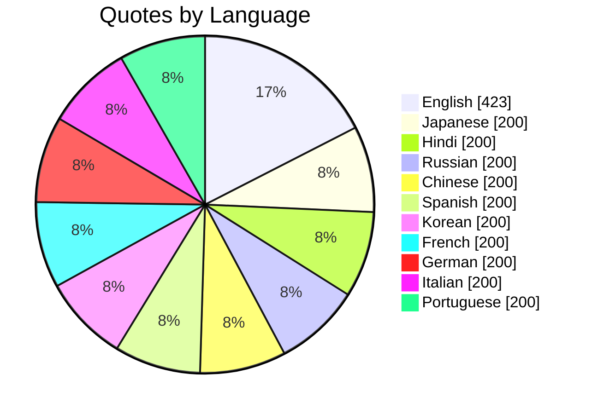

# [AniQuotes](https://aniquotesapi.vercel.app/) Statistics

 
    

---

---
  
**[AniQuotes](https://github.com/AniQuotes)** For inquiries or collaborations
     

Maintained by [Shinei Nouzen](https://github.com/Shineii86) © 2025 AniQuotes - All Rights Reserved

